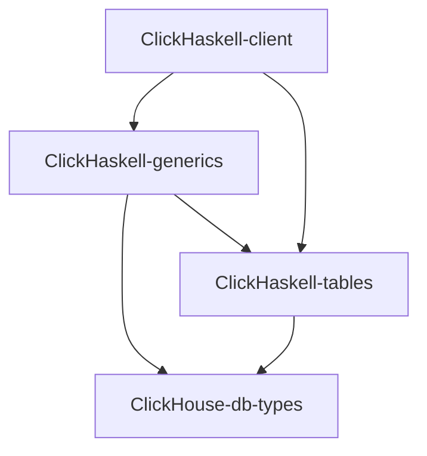

# ClickHaskell

ClickHaskell is a set of packages:



### `ClickHaskell-client` package
Provides high level API for communication with database server

### `ClickHaskell-generics` package
Provides generation encoders and decoders from records

### `ClickHaskell-tables` package
Provides API for description database protocols - `Table`s and `Parametrized View`s

This protocols allows you to:
1. Perform reading and writing on subsets of columns
2. Be sure that encoders and decorders compatible with given protocol

# Development

We are using [Nix flakes](https://nixos.wiki/wiki/Flakes) to set up whole development environment

When you have configured Nix. Enter into your console
```bash
nix run
```

Nix will setup a database with development required schemas for you.

After `dev-database` Health status is `Ready`, you can start to work with database dependent code parts
