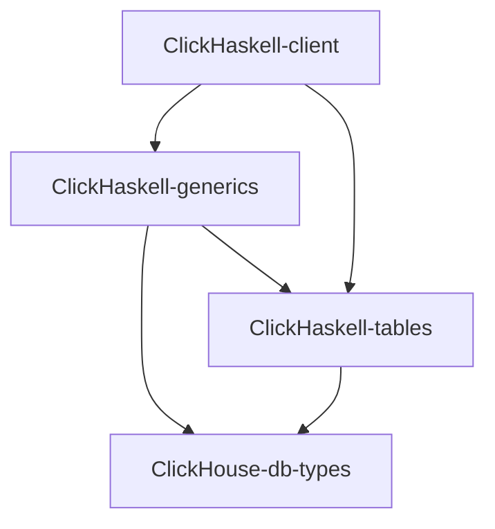

# ClickHaskell

ClickHaskell is a set of packages:

### `ClickHaskell`-prefixed packages provides:
1. Type validatable DSL client operations over tables
2. Generic deriving `decoders`, `encoders`, `queries` over tables
3. Describing `tables`

You can read about each one DSL from its own documentation

### `ClickHouse`-prefixed packages provides:
1. Primitives of `ClickHouse interfaces parts`
2. Implementation of abstractions over `ClickHouse interfaces parts`
