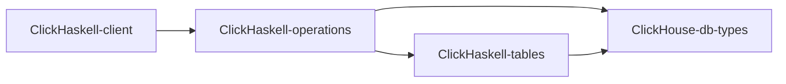

# ClickHaskell

ClickHaskell is a set of packages:

### `ClickHaskell`-prefixed packages provides:
1. DSL for describing DBMS sematincs
2. Emdedding abstactions for other DSLs (except `ClickHaskell-client`)

You can read about each one DSL from its own documentation

### `ClickHouse`-prefixed packages provides:
1. Primitives of `ClickHouse interfaces parts`
2. Implementation of abstractions over `ClickHouse interfaces parts`
